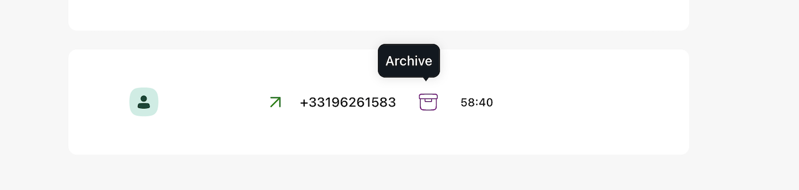

### Table of contents

- [Available Scripts](#available-scripts)
- [Folder structure](#folder-structure)
- [Choices](#choices)
- [Features](#choices)
- [Improvements](#improvements)


## Available Scripts

In the project directory, you can run:

### `yarn start`

Runs the app in the development mode.\
Open [http://localhost:3000](http://localhost:3000) to view it in the browser.

The page will reload if you make edits.\
You will also see any lint errors in the console.

### `yarn test`

Launches the test runner in the interactive watch mode.\
See the section about [running tests](https://facebook.github.io/create-react-app/docs/running-tests) for more information.

### `yarn build`

Builds the app for production to the `build` folder.\
It correctly bundles React in production mode and optimizes the build for the best performance.

The build is minified and the filenames include the hashes.\
Your app is ready to be deployed!

### `yarn lint`

Scans the app for `eslint` errors

### `yarn format`

Formats the code.

### Folder structure

```
src/     
  ├── components/      
        ├── shared/
        └── routing/
  ├── copy/
  ├── lib/ 
        ├── actions/     
        └── contexts/    
        └── gql/         
        └── hooks/       
        └── services/    
        └── utils/    
  ├── pages/
  ├── style/
  ├── types/ # → All reusable TypeScript types
```

### Choices

- All text is under the `copy` folder.
- Some of the Aircall components didn't work properly, as the project has installed a `next` version of the UI library. This is why in some cases, like the [PageSkeleton](src/components//shared//PageSkeleton/PageSkeleton.tsx) component I had to create my own using the [react-content-loader package](https://www.npmjs.com/package/react-content-loader).
- I decided to use the `Context` API to store state and use `Apollo` for the msot of the client state using reactive variables.
- I've made a choice to filter calls on the client using the Context API, as I didn't manage to make the Apollo client filter options work.

### Features

##### - Home Page

- Home page renders a [LoginForm](src/components/shared/LoginForm/LoginForm.tsx) component.
- `<LoginForm />` has client side validation that checks that `username` is at least 3 characters and a password has at least 8 characters. Check [useForm hook](src/lib/hooks/useForm.tsx) to see how it works.
- Submit button is enabled only when these constraints are satisfied.  Check [useDisableSubmit hook](src/lib/hooks/useDisableSubmit.tsx) to see how it works.
- After successful login, `access_token` and user related data are being stored in cookies using the `js-cookie` package instead of `localstorage`; this choice was made for security reasons to prevent against possible [XSS attacks](https://owasp.org/www-community/attacks/xss/). 


##### - Calls Page

-  Filter values (`missed`, `voicemail`, `answered`, `all`)
- Call list items show an outbound call using the `OutboundOutlined` icon and an inbound call using
the `InboundOutlined` icon.
- `Answered / unanaswered` calls are indicated by coloring the icons green / red respectively.
- Archive action is triggered by clicking the Archive icon. Archive icon changes depending on the action;
if the item is archived user sees the `ArchiveFilled` icon and the `ArchiveOutlined` icon when the call is not archived. The `Tooltip` component was used to show users which action they will trigger if they click on each icon. 

#### Screenshots below:

<details>
<summary>
    Archive screenshot
</summary>

</details>
<details>

<summary>
    Restore from archive screenshot
</summary>
</details>

### Improvements

- At the moment when the `access_token` expires, the user gets redirected back to the login page. As this is not the best UX, the app should use the `refresh token` endpoint instead. I didn't manage to make it work properly so went with the redirect option instead. See [usePageRedirect hook](src/lib//hooks/usePageRedirect.ts).
- Due to lack of time an end to end test is missing. `react-testing-library` is installed and configured but not used.
- Real time feature when user archives a call. I tried using `subscriptions` using the `subscriptions-transport-ws` package, but didn't get it to work properly so this feature is not implemented.
- App should also check for different errors to show helpful error messages. At the moment it only checks for Not authenticated errors.